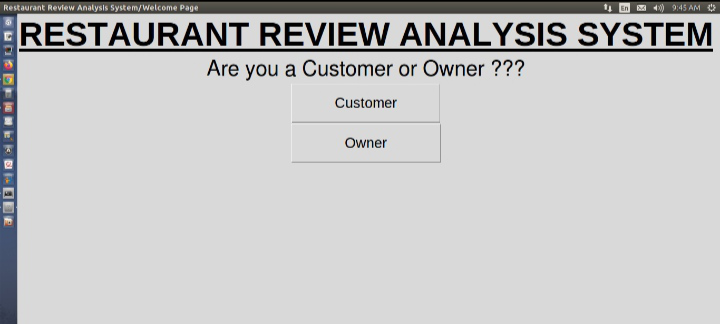
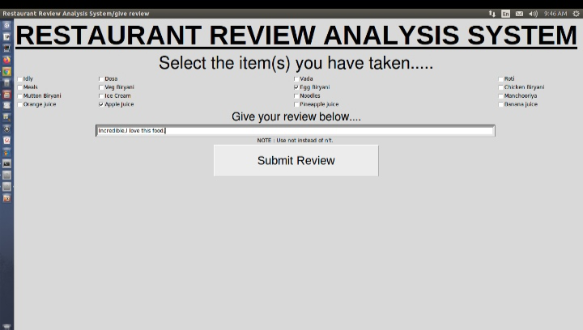
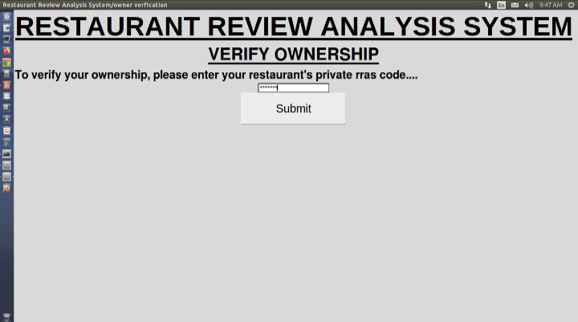
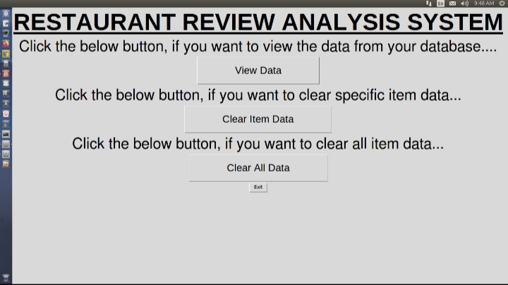

#  Restaurant Review Analysis System

A sentiment analysis-based system for analyzing restaurant reviews and presenting data about food items' popularity and customer sentiment. The application uses a Naive Bayes classifier for sentiment analysis and provides an interactive GUI for displaying the results.


## Table of Contents

- [Features](#features)
- [Technologies Used](#technologies-used)
- [Installation](#installation)
- [Usage](#usage)
- [Project Structure](#project-structure)
- [Screenshots](#screenshots)
- [Future Improvements](#future-improvements)
## Features
- Sentiment analysis of restaurant reviews using a Naive Bayes classifier.
- Storage and management of review data in a SQLite database.
- Interactive GUI to view and analyze review data by food items.
- Dynamic updating of review statistics based on new inputs.
## Technologies Used

- **Python**: Core programming language.
- **SQLite**: For database management.
- **Scikit-learn**: For building the Naive Bayes classifier.
- **Tkinter**: For GUI development.
- **NLTK**: For text preprocessing and sentiment analysis.
## Installation

### Prerequisites
- Python 3.8 or higher
- SQLite installed on your system

### Steps
1. Clone the repository:
   ```bash
   git clone <repository-url>
   cd <repository-folder>

2. Install required Python packages:
   ```bash
   pip install -r requirements.txt

3. Set up the database:
   ```bash
   python setup_database.py
4. Download NLTK stopwords:
   ```bash
   python -c "import nltk; nltk.download('stopwords')"


## Usage

1. Run the main application:
   ```bash
   python app.py

2. The GUI will launch:
- input a restaurant review.
- Select relevant food items from the list.
- Submit the review for sentiment analysis.

3. View the updated food item statistics in the View Details section.

4. To verify the current contents of the database:
    ```bash
    python database_verification.py


## Project Structure

   ```bash
    ├── analysis.py               # GUI for viewing food item statistics
    ├── app.py                    # Main application entry point
    ├── database.py               # Database operations
    ├── database_verification.py  # Verify database contents
    ├── interface.py              # GUI component for database visualization
    ├── preprocessing.py          # Text preprocessing and model training
    ├── requirements.txt          # List of dependencies
    ├── Restaurant_Reviews.tsv    # Dataset
    ├── Restaurant_food_data.db   # SQLite database
    ├── setup_database.py         # Database setup script
    └── README.md                 # Project documentation
  ```


## Screenshots










## Future Improvements

- Allow dynamic addition of food items through the GUI.
- Add real-time sentiment visualization graphs.
- Implement user authentication for better access control.
- Improve model performance by experimenting with other algorithms like SVM or deep learning.
## License

This project is licensed under the MIT License.
